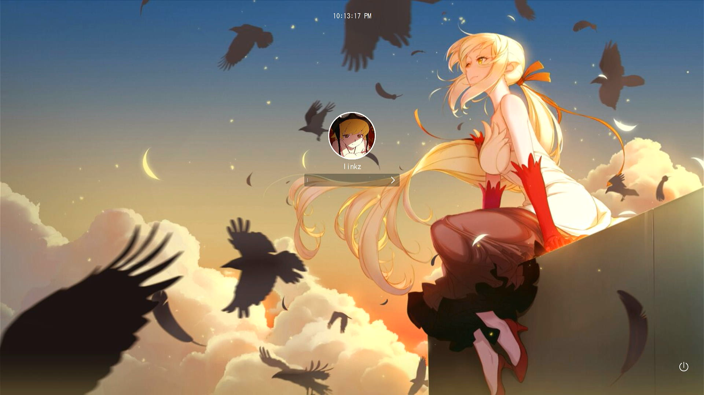

# Anime theme for Sddm

## **A simple anime theme for SDDM**
Also used in [archlinkz-dotfiles](https://github.com/l1nkzz1/archlinkz-dotfiles)


## Preview :
- Shinobu



## Installation :

clone the repo and run install.sh with sudo.
```
git clone https://github.com/shinas101/Anime-sddm-theme.git
cd Anime-sddm-theme
chmod +x ./install.sh
sudo ./install.sh
	eg : sudo ./install.sh
		Select a Background :
		1) Shinobu
		[*]Theme Installed successfully


```
### how to add avatar :
- Copy your avatar to `/usr/share/sddm/faces/` as \<username\>.face.icon
-   eg: `/usr/share/sddm/faces/linkz.face.icon`
